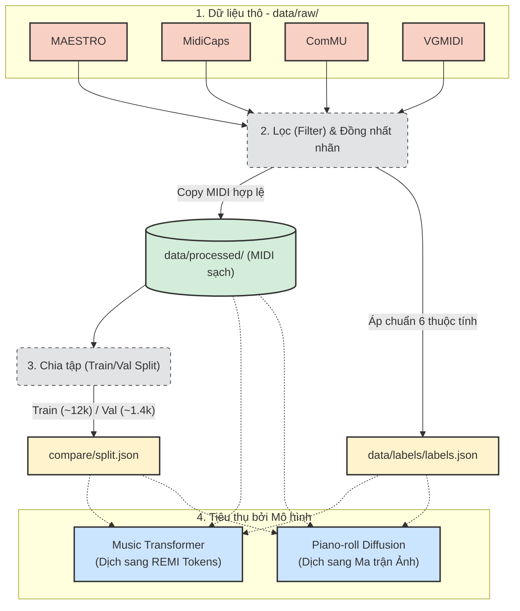

# Quy trình Tiền xử lý dữ liệu (Data Preprocessing)

Tài liệu này mô tả cách luồng dữ liệu thô (Raw Data) được làm sạch, đồng nhất và chia sẻ chung cho cả 2 mô hình Transformer và Diffusion nhằm đảm bảo tính công bằng tuyệt đối khi so sánh.

## Sơ đồ luồng dữ liệu (Data Pipeline)

## Các bước thực hiện chi tiết

### Bước 1: Thu thập Dữ liệu thô (Raw Data)
Tất cả các file nhạc được tải về từ nhiều nguồn khác nhau (như MAESTRO, MidiCaps, ComMU...) được tập hợp vào thư mục `data/raw/`. Ở giai đoạn này, dữ liệu chưa có sự đồng nhất:
- Tồn tại những file nhạc bị lỗi kỹ thuật, không thể đọc được (gọi là **corrupt data**).
- Thông tin mô tả đi kèm của bài nhạc (gọi là **Metadata** - ví dụ như tên bài, thể loại, nhạc cụ) được tổ chức rất lộn xộn. Mỗi bộ dữ liệu gốc lại có một quy chuẩn lưu trữ khác nhau.

### Bước 2: Lọc và Chuẩn hóa nhãn (Filter & Generate Labels)
Hệ thống sẽ chạy kịch bản (script) tự động để làm sạch dữ liệu:
1. **Lọc (Filtering):** Phần mềm sẽ quét qua toàn bộ file nhạc. Bất kỳ file nào bị lỗi định dạng sẽ bị loại bỏ. Những file đạt tiêu chuẩn sẽ được chuyển sang thư mục dữ liệu sạch `data/processed/`.
2. **Chuẩn hóa nhãn (Labeling):** Thay vì giữ nguyên siêu dữ liệu (metadata) lộn xộn ban đầu, thuật toán sẽ trích xuất và quy chuẩn (map) chúng về đúng **6 thuộc tính chuẩn** của dự án (Tâm trạng, Thể loại, Hoàn cảnh, Nhịp độ, Nhạc cụ, Năng lượng).
3. **Lưu trữ:** Toàn bộ hệ thống nhãn sau khi chuẩn hóa được tổng hợp vào một tập tin duy nhất `data/labels/labels.json`. Hiện tại, có khoảng hơn **14.000 bản nhạc** đạt yêu cầu.

### Bước 3: Phân chia tập dữ liệu (Train/Val Split)
Nếu đưa toàn bộ 14.000 bản nhạc cho AI huấn luyện (gọi là **Train**), mô hình sẽ dễ rơi vào trạng thái "học vẹt" (gọi là **Overfitting** - tức là mô hình chỉ ghi nhớ máy móc dữ liệu cũ mà mất đi khả năng sinh ra bản nhạc mới một cách sáng tạo).
Để khắc phục, hệ thống sẽ chia ngẫu nhiên dữ liệu thành 2 tập riêng biệt:
- **Tập Huấn luyện (Train set):** Khoảng 12.809 bài (90%) - Dùng để trực tiếp dạy cho AI.
- **Tập Kiểm định (Validation set / Val):** Khoảng 1.423 bài (10%) - Giữ hoàn toàn độc lập để đánh giá năng lực thực sự của AI trong quá trình học.
Danh sách phân chia này được ghi nhận tại file `compare/split.json`.

### Bước 4: Biểu diễn Dữ liệu (Data Representation)
Để AI có thể xử lý được âm nhạc, bản nhạc MIDI phải được biến đổi sang định dạng toán học mà mô hình có thể hiểu:
- **Mô hình Transformer:** Bản nhạc được mã hóa thành các **chuỗi từ vựng (REMI tokens)**. Cách tiếp cận này coi bản nhạc như một câu văn dài, giúp AI xử lý âm nhạc tương tự như cách ChatGPT xử lý ngôn ngữ.
- **Mô hình Diffusion:** Bản nhạc được biến đổi thành một **ma trận hình ảnh 2D (Piano-roll)**. Các nốt nhạc được biểu diễn dưới dạng các điểm ảnh. Cách tiếp cận này chuyển bài toán sinh nhạc thành bài toán sinh hình ảnh (giống như Midjourney hay Stable Diffusion).

***Ghi chú:*** Việc yêu cầu cả 2 mô hình phải dùng chung một bộ dữ liệu đã làm sạch (`processed/`) và chung một danh sách kiểm định (`split.json`) nhằm đảm bảo **tính công bằng tuyệt đối** khi tiến hành đo lường và so sánh hiệu suất giữa chúng ở giai đoạn sau.
